<h1 align="center">Hi there, I'm Simon 👋</h1>
<h3 align="center">An experienced Junior Developer leader and upskiller, with a passion for team growth and clean code! </h3>

  

---

## 👨‍💻 About Me

- 🔭 I’m currently working at [**GEOLYTIX**](www.geolytix.com) as Head of MAPP Client Delivery.  I've had a range of roles in the 5 years I've been here.  Beginning as a Junior Developer configuring [GEOLYTIX MAPP](https://geolytix.com/geolytix-mapp/), I am now responsible for a team of 6 delivering MAPP to our large and expansive client pool.  I'm currently splitting my time across upskilling and developing the Delivery Team, while also creating and reviewing Pull Requests to improve our Open-Source software - [GEOLYTIX XYZ/MAPP](https://github.com/GEOLYTIX/xyz) .  
- 🌱 I’m currently improving my skills at **JavaScript** and exploring more front-end frameworks like **React**
---

## 🛠️ Tech Stack

### 🚀 Experienced

  
  
  
  
  
  

### 📈 Intermediate

  
  

### 🌱 Novice

  
  

---

## 📊 GitHub Stats

  

 

  <!-- GitHub Streak Stats -->
  

---

  

